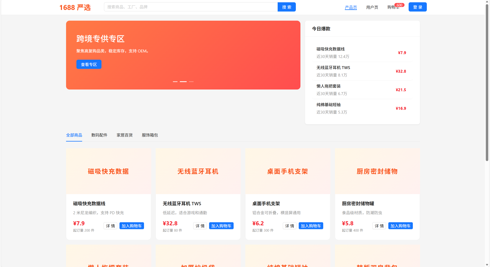
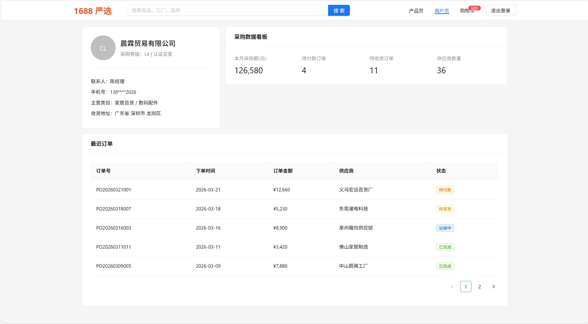
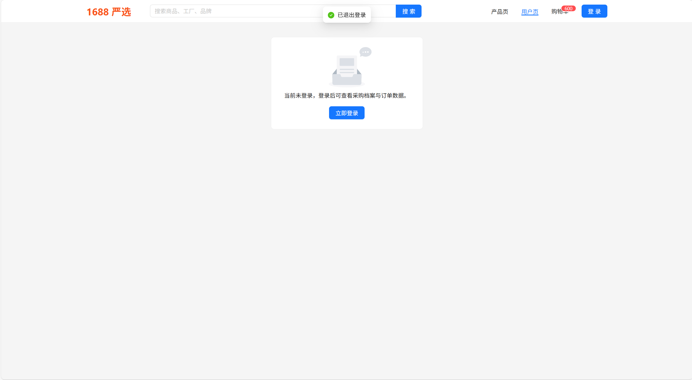
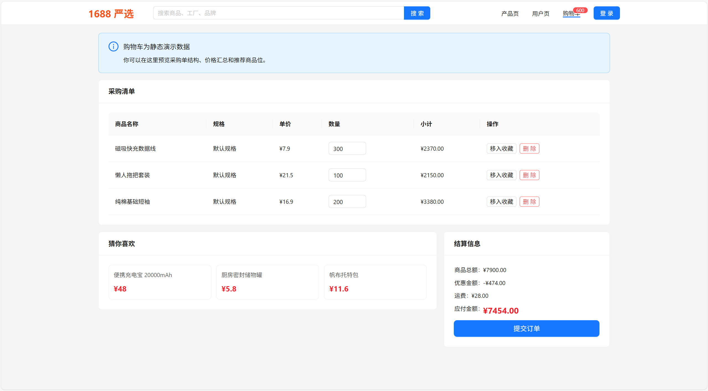

# Vue 3 + Vite

使用了AntDesign UI库补全页面
使用静态数据为主
包含三个主要页面,产品页面,用户页面,购物车页面

#### 产品页面 主页面

- 包含搜索框,基本轮播图,今日热搜
- 可点击详情查看产品模拟卡片
  

#### 用户页面

- 包含用户模拟信息和最近订单
- 内置用户模拟登录
  
  

#### 购物车页面

- 购车添加商品(点击加入购物车,点击删除购物车功能已完善)
- 实时计算结算订单数据,其上购物车入口按钮红点可查看实时商品数量
  
  =======

#### 个人练手项目 vue+vite
